# eTicketing Support Ticketing System

An internal ticketing system built with React, Express, MySQL, and Socket.IO. Users can create and track support tickets, communicate with an administrator in real time, upload supporting files, and confirm whether a problem has been solved. Administrators can review, filter, assign, update, and close tickets.

## Features

- User registration and JWT-based login
- Separate user and administrator dashboards
- Ticket creation with subject, description, category, priority, and status
- Administrator assignment and ticket workflow management
- Real-time ticket conversations with Socket.IO
- Image, GIF, WebP, and PDF attachments up to 10 MB
- Ticket activity logs and PDF export
- MySQL persistence for users, tickets, messages, and attachment metadata
- Production mode that serves the built React application from Express

## Technology

- Frontend: React, React Router, Vite
- Backend: Node.js, Express, Socket.IO
- Database: MySQL
- Authentication: JSON Web Tokens and bcrypt

## Project Structure

```text
Backend/       Express API, Socket.IO server, uploads, and database models
database/      MySQL schema and seed accounts
docs/          Architecture, flowcharts, UI, and use-case documentation
frontend/      React/Vite client application
```

## Requirements

- Node.js 18 or newer for the backend build target
- MySQL 8 or a compatible MySQL server
- npm

## Database Setup

Run `database/setup.sql` on a fresh MySQL server. The script creates the `ticketing` database, tables, constraints, a trigger for ticket resolution time, and sample accounts.

The seeded accounts all use the password `password123`:

| Username | Role |
| --- | --- |
| `admin` | Administrator |
| `user1` | User |
| `user2` | User |
| `user3` | User |

Change or remove these accounts before using the system outside a test environment.

## Configuration

Create `Backend/.env` with the database and server settings required by your environment:

```env
PORT=5000
IP_ADDRESS=0.0.0.0
DB_HOST=localhost
DB_PORT=3306
DB_NAME=ticketing
DB_USER=your_mysql_user
DB_PASSWORD=your_mysql_password
```

`IP_ADDRESS` controls the interface the backend listens on. Use the server's LAN address, or `0.0.0.0` to listen on all interfaces. Keep `.env` private.

## Run Locally

Install dependencies in both applications:

```bash
cd Backend
npm install

cd ../frontend
npm install
```

Start the backend in one terminal:

```bash
cd Backend
npm start
```

Start the Vite development server in another terminal:

```bash
cd frontend
npm run dev
```

The frontend defaults to `http://localhost:5173`. During development, Vite proxies `/api` and `/uploads` to `http://localhost:5005`. To use another backend address, create `frontend/.env`:

```env
VITE_BACKEND_URL=http://localhost:5000
VITE_DEV_HOST=0.0.0.0
VITE_DEV_PORT=5173
```

## Production Build

Build the frontend first:

```bash
cd frontend
npm run build
```

Then start the backend. Express serves `frontend/dist` and the API from the same server:

```bash
cd Backend
npm start
```

The backend can also be packaged as a Windows executable with:

```bash
cd Backend
npm run build
```

## Windows 7 Portable Browser Deployment

The supplied `GoogleChromePortable` folder contains Google Chrome Portable v109 downloaded from SourceForge. Version 109 is the final Chrome version that supports Windows 7. Keep this version for Windows 7 deployments; newer portable Chrome versions may not run on those systems.

To create another desktop shortcut application for a different system:

1. Copy the complete `GoogleChromePortable` folder to the target machine.
2. Update the deployment `config.txt` so its `IP_ADDRESS` points to the computer hosting this ticketing system.
3. Recreate or update the desktop shortcut/launcher to use that copied folder.

Copying the complete folder preserves the portable browser files and launcher arrangement. The portable browser bundle and local launcher files are intentionally ignored by Git because they are deployment assets rather than application source code.

## Network Notes

For users on another computer, make sure the backend host is reachable on its configured port, Windows Firewall allows that port, and the frontend proxy or packaged frontend points to the correct backend address. Socket.IO and attachment URLs must use the same reachable host as the API.

## System Documentation

The following diagrams and screenshots describe the database design, ticket workflow, user roles, and main application screens.

### Entity Relationship Diagram

The database stores users, tickets, and ticket conversation messages. Tickets belong to users and may be assigned to an administrator; messages belong to tickets and record text, read state, and optional attachment metadata.

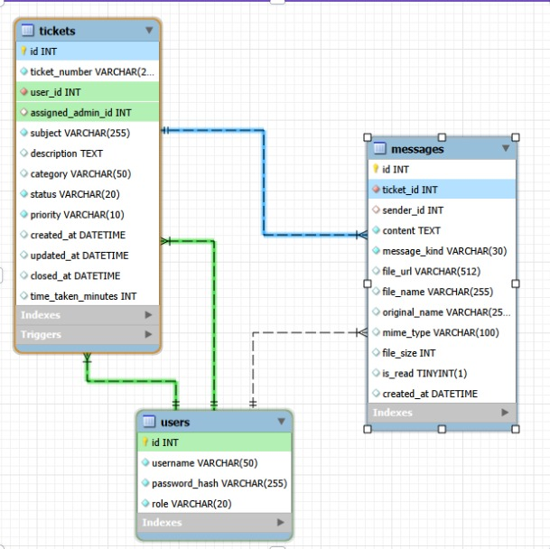

### Overall Ticket Workflow

This flow shows the complete user journey: registration or login, ticket creation, administrator assignment, support questions or solutions, user confirmation, and ticket closure.


### Use-Case Diagrams

#### User Use Cases

Users can register and log in, view and filter their tickets, create new tickets, open ticket conversations, send messages, attach files, and confirm whether a solution resolved the issue.

[Open the eTicketing user use-case diagram source in diagrams.net](docs/media/use-cases/userusecasediagram.drawio)

#### Administrator Use Cases

Administrators can log in, view and filter all tickets, assign tickets, update type/status/priority, ask questions, provide solutions, review conversations, and close tickets.

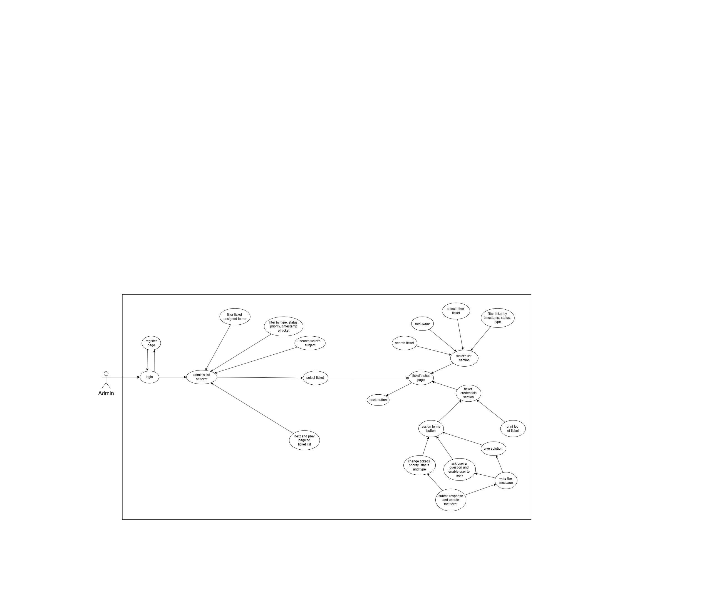

### User Interface Screens

#### Administrator Dashboard

The administrator dashboard provides a searchable, filterable ticket table with assignment, status, priority, activity, submission date, closure date, and resolution time.

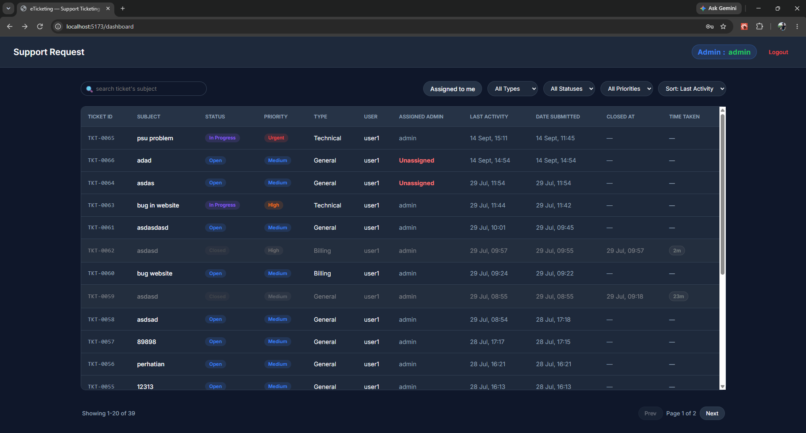

#### Administrator Ticket Workspace

The administrator workspace displays ticket details, customer information, workflow controls, response options, and the complete conversation thread.

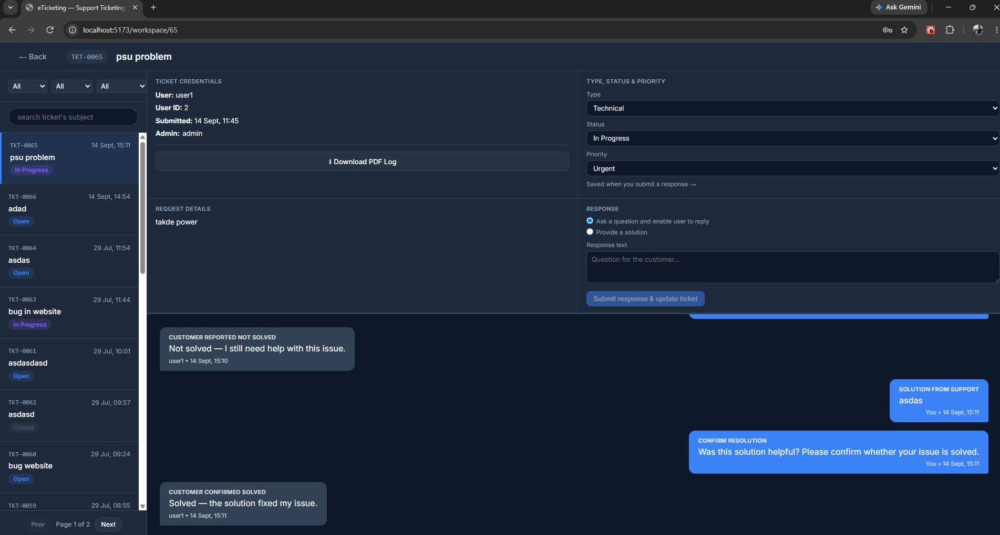

#### Administrator Closed Ticket Workspace

After the user confirms that the issue is solved, the administrator workspace shows the closed status, resolution time, completed conversation, and the notice that no further responses can be sent.

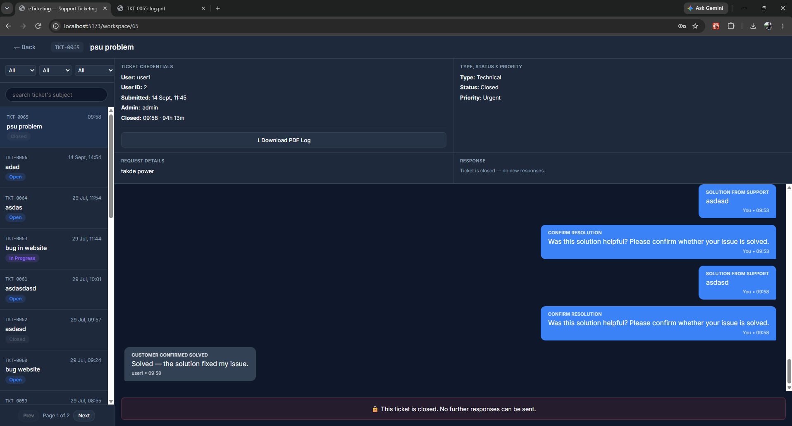

#### User Ticket List

The user dashboard lists the user's tickets with search, status and activity filters, ticket status, priority, and assigned administrator information.

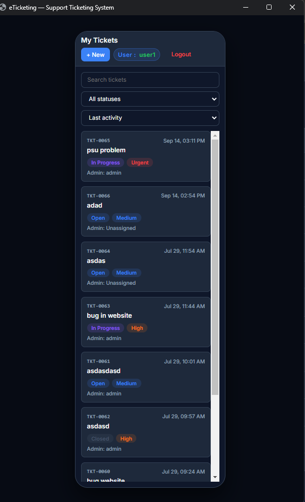

#### User Ticket Conversation

The user workspace shows the selected ticket, support responses, resolution prompts, and the controls used to confirm a solution or report that the issue remains unresolved.

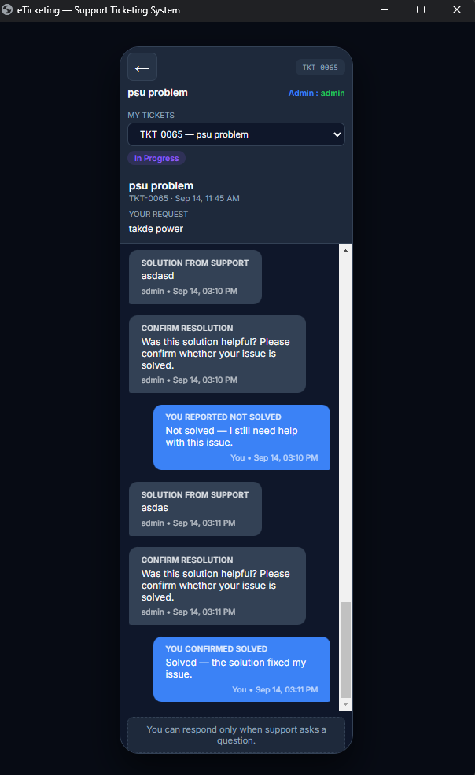

#### User Resolution Response

When support requests confirmation, the user can submit a solved or not-solved response from the conversation view.

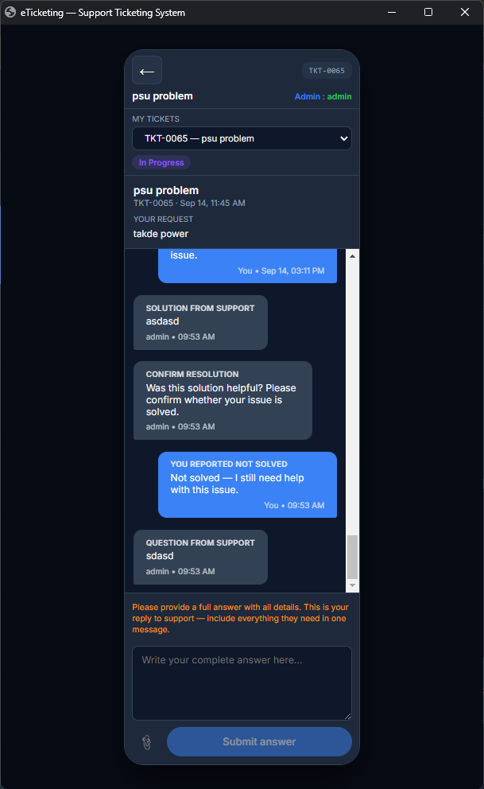

#### User Support Reply

When an administrator asks a question, the user can provide a complete reply and optionally attach a supported file.

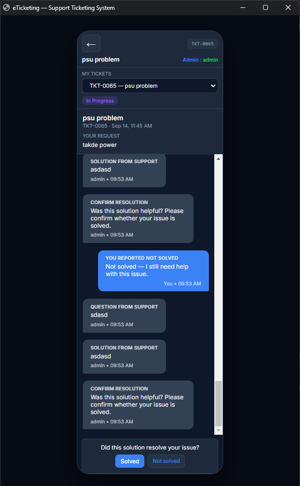

#### User Closed Ticket View

The closed-ticket view shows the completed resolution response and informs the user that a new ticket must be opened for additional help.

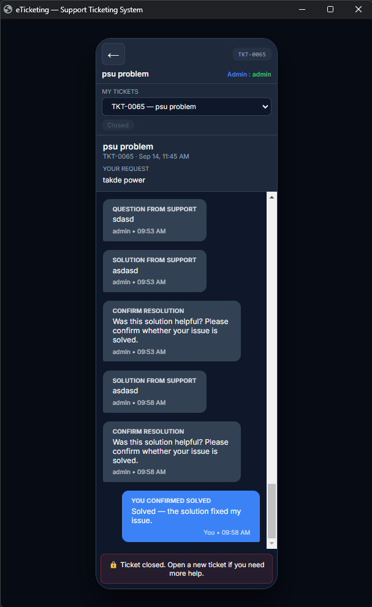

#### PDF Conversation Log

Administrators can download a formatted PDF log containing ticket details and the conversation transcript for record keeping.

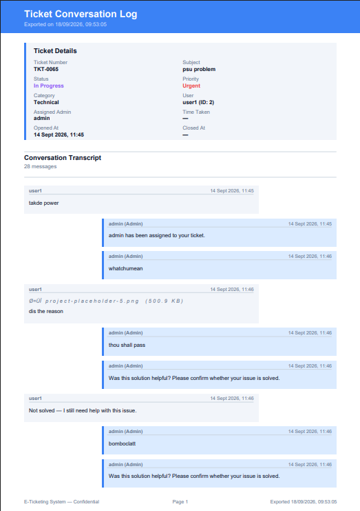

#### Completed PDF Conversation Log

The completed log includes the closed status, assigned administrator, time taken to resolve the ticket, closure timestamp, and the full conversation transcript.

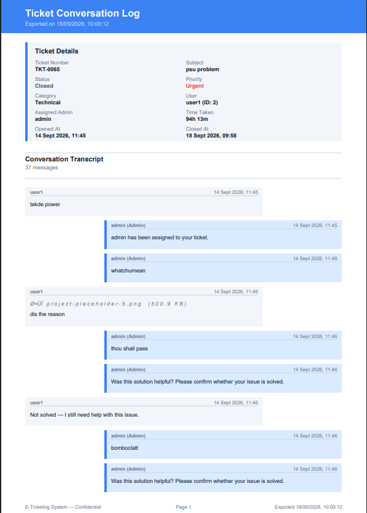

## Security Notes

- Replace the seeded passwords before deployment.
- Use strong database credentials and keep `.env` out of source control.
- Restrict Socket.IO CORS origins instead of allowing every origin in a production network.
- Review uploaded files and the upload directory permissions before exposing the system beyond a trusted network.